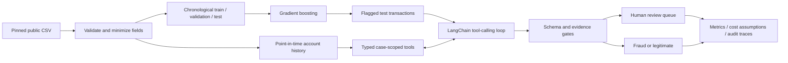

# Agentic Fraud Triage

A Python investigation pipeline that gives a tool-calling language model bounded access to transaction history, validates its calls, and sends uncertain cases to a human review queue. Includes a gradient-boosted baseline and a chronological, same-cohort evaluation harness.

**Status:** implemented and tested; public-data baseline and deterministic protocol benchmark included. **Live Hugging Face LLM evaluation has not been run** because no inference token was configured. The replay backend is an explicit test fixture, never an LLM substitute in reported claims.

## Architecture



- **Python + LangChain:** `StructuredTool`, Pydantic schemas, tool-result messages, and a bounded agent loop.
- **Hugging Face:** `ChatHuggingFace` / `HuggingFaceEndpoint` for a tool-capable hosted chat model.
- **Evidence:** prior account counts, mean amounts, amount ratios, and 1-hour / 24-hour velocity. All features exclude the current transaction, simultaneous transactions, and future events.
- **Abstention:** less than three historical transactions, missing evidence, confidence below 0.8, invalid-call exhaustion, or provider failure produces `review`.
- **Evaluation:** train/validation/test time splits, validation-only thresholds, identical alert cohorts, explicit abstention denominators, and configurable cost assumptions.

The system produces investigation suggestions and JSONL queues. It does not approve, block, or move money.

## Quick start

Python 3.12 is the recorded benchmark environment. Python 3.11+ is supported by the package dependency ranges.

```bash
python3.12 -m venv .venv
source .venv/bin/activate
python -m pip install -r requirements.lock
python -m pip install --no-deps -e .

# No network or API key needed after installation
fraud-triage demo --rows 5000 --max-cases 100
pytest -q
ruff check .
```

For a fresh dependency resolution instead of the recorded versions, use `python -m pip install -e '.[dev]'`.

## Public-data benchmark

```bash
fraud-triage fetch --rows 100000 --output data/public.csv
fraud-triage benchmark --data data/public.csv \
  --backend replay --max-cases 100 --output artifacts/public-replay
```

The fetcher streams the first 100,000 source rows from a pinned revision of the [public Sparkov CSV mirror on Hugging Face](https://huggingface.co/datasets/dazzle-nu/CIS435-CreditCardFraudDetection/tree/f5d3f80f0f1dfdab4b8a5537156fb0cfae82c6d8). These are **simulated transactions**, not real bank customer activity. Sparkov's [upstream generator](https://github.com/namebrandon/Sparkov_Data_Generation) documents the simulation approach.

Only transaction ID, a hashed account identifier, timestamp, amount, and the evaluation label are retained. Names, addresses, dates of birth, and raw card numbers are discarded. Hashing here is field minimization, not a claim of anonymization. Naive source timestamps are treated as UTC for consistent ordering; they are not verified real-world UTC event times.

The canonical CSV gets a source-revision/checksum manifest. The loader verifies that checksum before benchmarking. Data are ignored by Git, and no source data license is claimed or transferred by this repository. Check upstream terms before redistribution.

### Recorded results

[Full report](reports/public-replay/benchmark.md) · [Machine-readable report](reports/public-replay/benchmark.json) · [Audit traces](reports/public-replay/investigations.jsonl) · [Human review queue](reports/public-replay/review_queue.jsonl)

100,000 public simulated rows, 60/20/20 chronological split, seed 42:

| System / population | Cases | Precision | Recall, all fraud | Review rate |
|---|---:|---:|---:|---:|
| Gradient boosting, full holdout | 20,000 | 78.7% | 64.9% | 0% |
| Gradient boosting, sampled alerts | 100 | 66.7% | 80.0% | 0% |
| Deterministic rule fixture, same alerts | 100 | 10.0% | 40.0% | 25.0% |

**These results do not establish LLM performance or an improvement over the baseline.** The fixture deliberately exercises the complete protocol with simple rules. Only five fraud cases occur in the 100-alert sample; those cohort metrics are descriptive and too small for strong statistical conclusions.

At an **assumed $3 per human review**, replay's token-plus-review cost is $0.75 per investigation. The forced binary baseline has no token or review charges under this narrow accounting. Hardware, training, operational overhead, and the cost of wrong decisions are excluded for both. These are scenario estimates, not bills or a total-cost comparison.

## Run the live Hugging Face agent

Use a token with access to Hugging Face Inference Providers. Export it in your shell; `.env.example` is a template and is not loaded automatically.

```bash
export HUGGINGFACEHUB_API_TOKEN='your-token'
export HF_MODEL='Qwen/Qwen2.5-7B-Instruct'
fraud-triage benchmark --data data/public.csv \
  --backend hf --max-cases 20 --output artifacts/hf
```

The model must support native tool calling through the selected provider. Availability and tool support depend on the provider; another compatible model can be selected with `--model-id`. The bounded loop permits at most six model calls per investigation, four tool calls per response, and two repair opportunities. Provider request timeout is 60 seconds. HF provider usage may incur charges.

Pass `--input-per-million` and `--output-per-million` using the provider's actual rates to enable estimated LLM costs, and `--human-review-usd` for your review assumption. Missing rates or usage metadata produce `null` cost, never a falsely free investigation. Provider failures become review cases and are counted separately. Do not interpret an all-provider-error run as an accuracy benchmark.

The model receives only the active transaction's ID, timestamp, amount, and requested aggregates. Fraud labels, full account identifiers, and baseline scores are excluded. Each tool is scoped to the active case, so an invented or cross-case ID cannot retrieve another account's data. The prompt is not the access-control boundary; the Python tool wrappers enforce it.

## Outputs

Each run writes:

| File | Contents |
|---|---|
| `benchmark.json` | Dataset checksum, package versions, split counts, thresholds, cohort IDs, metrics, costs, failures and limitations |
| `benchmark.md` | Compact results table |
| `investigations.jsonl` | Every final decision, evidence, tool trace, token counts, and latency |
| `review_queue.jsonl` | Only abstained investigations, ready for a downstream human workflow |

A queue record includes the reason and evidence, but no ground-truth label. The benchmark evaluates labels after investigation. No human outcomes are invented or credited as successful detection.

## Evaluation design

1. Sort transactions and split at 60% and 80% timestamps, keeping identical timestamps together.
2. Build point-in-time aggregates from prior unlabeled events. Earlier holdout events may be used as history for later events, as in an online stream; future events and all history labels are excluded.
3. Train `HistGradientBoostingClassifier` on the earliest partition. Select the binary threshold by validation F1 and the flag threshold by the validation score's 90th percentile.
4. Score the untouched test partition. Uniformly sample at most `--max-cases` eligible alerts with seed 42, without label-based selection.
5. Compare baseline and agent on exactly those transaction IDs; separately report baseline performance on the entire holdout.

Precision is the fraction of automatic fraud verdicts that are fraud. `recall_all_fraud` divides automatically caught fraud by **all** cohort fraud, including abstentions. `recall_decided_fraud`, selective accuracy, coverage, review rate, and fraud-in-review counts are reported separately. Undefined metrics are JSON `null`.

The two systems share observable feature families. The baseline sees numeric features directly; the agent requests aggregates through tools. LLM self-reported confidence is not a calibrated probability. Fixed agent rules and thresholds were not tuned against test labels. The dataset-prefix selection and absence of label-delay modeling limit generalization.

## Development

```bash
pytest -q
ruff check .
ruff format --check .
```

CI runs unit/integration tests and a credential-free smoke benchmark on Python 3.12. Tests cover timestamp boundaries, future/label leakage, account isolation, schema rejection and repair, retry/step limits, invented evidence, provider errors, abstention metrics, missing cost metadata, and deterministic cohort selection.

See [design notes](docs/design.md) for tradeoffs and the [model card](docs/model-card.md) for limitations. There is no claim of regulatory compliance, production readiness, or deployed human review operations.
